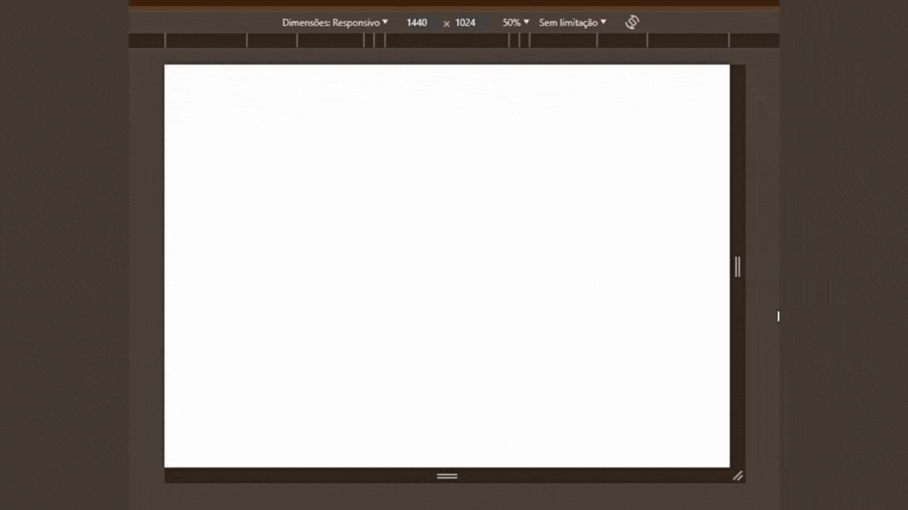
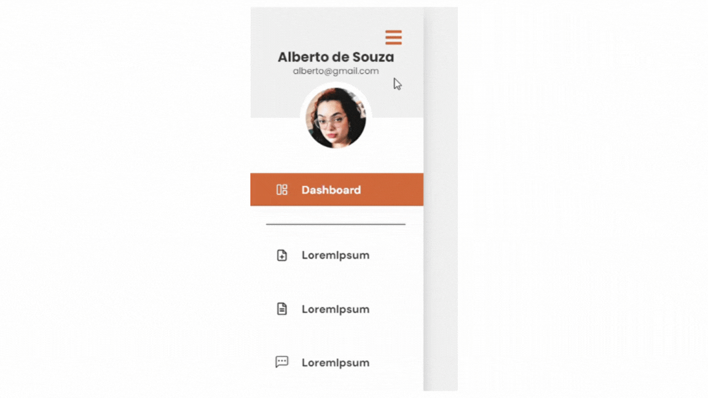
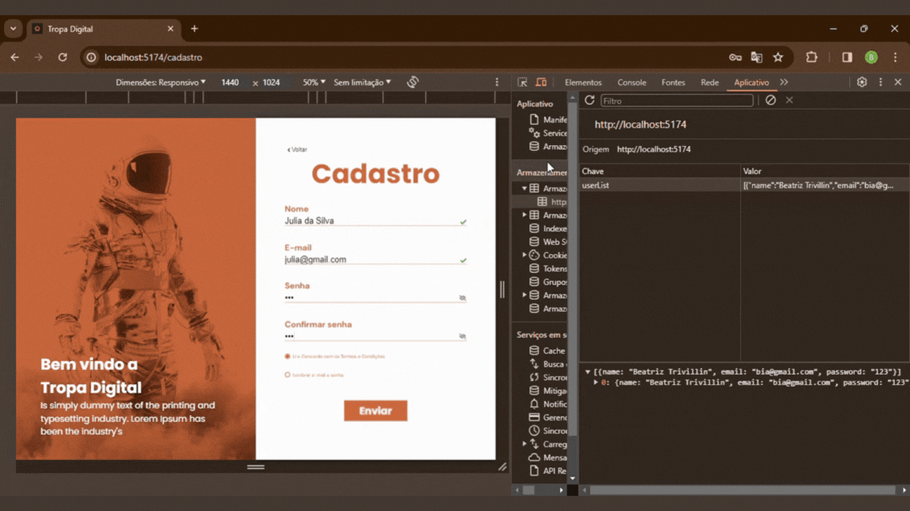
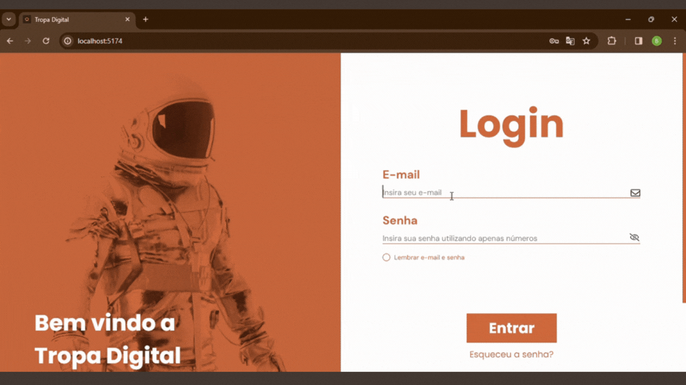
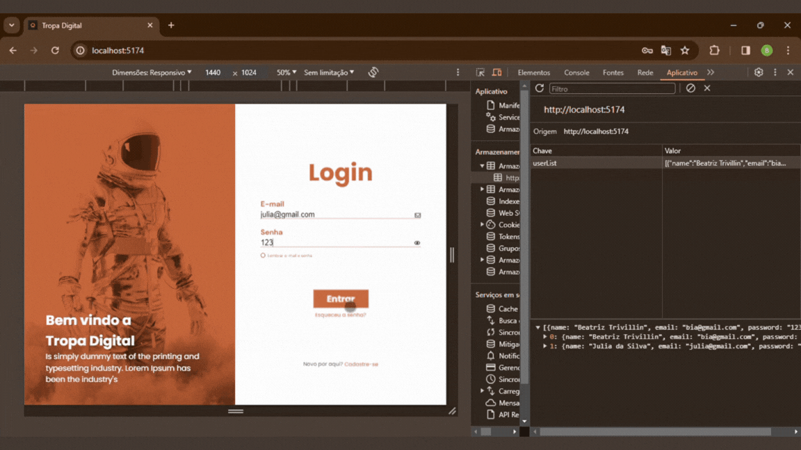
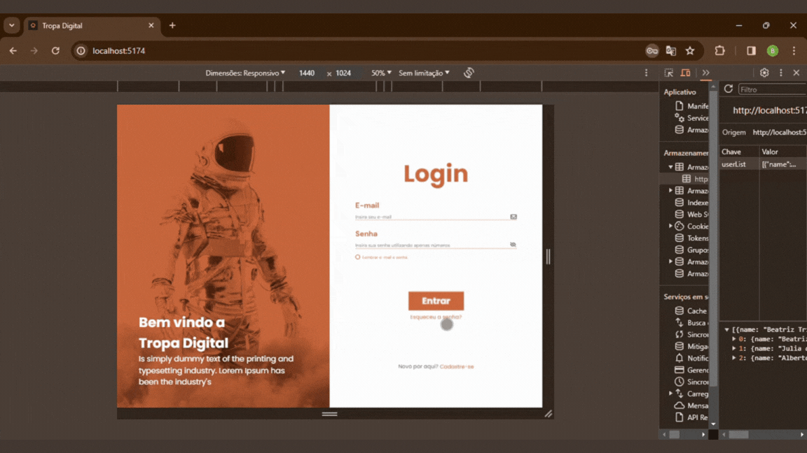

## 👩🏼‍🚀 TROPA DIGITAL 👩🏼‍🚀

>O projeto em questão envolveu o desenvolvimento de uma página de login, cadastro e dashboard utilizando ReactJS para a empresa Tropa Digital, especializada em desenvolvimento de software.<br>

## Tecnologias utilizadas
<div style="display: inline_block"><br>
  
  
  
  
  
  
  
  
  
  
  
</div>
<br>

## Features e detalhes 

## Animações
Animações e eventos de hover e click foram incluidos para possibilitar a criação de uma interface mais atrativa e intuitiva.<br>

<div align="center">
  
</div> <br>
<div align="center">
  
</div> <br>
<div align="center">
  
</div> <br>
<div align="center">
  
</div> <br>

##

## API's

**REACT ROUTER-DOM**<br>
Utilizada para criar e manipuar as rotas da aplicação.<br><br>

**REACT ICONS**<br>
Utilizada para incluir ícones ao projeto com mais facilidade. 

##

## Cadastro Funcional

**VIZUALIZAÇÃO DE SENHA**<br>
A aplicação conta com a opção de visualização de senha, que garante muito mais praticidade aos usuários.<br>
<div align="center">
  
</div> <br><br>

**VALIDAÇÃO**<br>
O formulário trabalha com três tipos de validação <br>
- **regex**<br>
Espressões regulares foram aplicadas a validação para garantir a integridade das informações fornecidas para o sistema. Confira a seguir as expressões regulares utilizadas no projeto.
```JavaScript
//senha -------------------------------------------------------------

/^[0-9]+$/
// garante que apenas números sejam aceitos no input de senha 

//email -------------------------------------------------------------

^[_a-z0-9-]+(\.[_a-z0-9-]+)*@[a-z0-9-]+(\.[a-z0-9-]+)*(\.[a-z]{2,4})$
// formato aceito: text@text.text

//nome -------------------------------------------------------------

/^[A-Za-záàâãéèêíïóôõöúçñÁÀÂÃÉÈÍÏÓÔÕÖÚÇÑ ]+$/
// permite apenas letras no campo de nome  
```
- **correspondência** <br>
O input "confirme sua senha" apenas é validado caso seu valor correspoda ao valor do input "senha".<br>
- **consulta** <br>
Já o input do email, por exemplo, passa por uma segunda validação. Com uma consulta aos dados, verifica-se se o email já está cadastrado no sistema. <br><br>

**MENSAGENS DE ERRO** <br>
Caso alguma informação estiver inconsistente, uma mensagem de erro será exibida para indicar o motivo pelo qual o registro não pôde ser concluído. Isso assegura uma interface muito mais acessível e intuitiva.<br>
<div align="center">
  
</div> <br><br>

**LOCALSTORAGE**<br>
Com todos os campos preenchidos e válidos, um objeto com as informações do usuário é enviado para o LocalStorage, que mais tarde será utilizado para simular o login.<br>
<div align="center">
  
</div> <br><br>

##

## Login Funcional 
**VALIDAÇÃO E LOCALSTORAGE**<br>
No momento do login também acontece a validação dos dados fornecidos. <br>Nesse caso, são utizadas as informações armazenadas no localStorage. Caso as informações coincidam, o login é realizado.<br> Caso contrário mensagens de erro serão exibidas para revelar quais dados estão incorretos.<br>
<div align="center">
  
</div> <br><br>

**TOKEN**<br>
Com o login bem sucedido, um token aleatório é gerado e armazenado no localStorage. Esse token será necessário para o acesso da rota '/dashboard'<br>
Caso o usuário tente alterar a rota da aplicação para '/dashboard' sem antes realizar login, ele será retirecionado para a página inicial. 
Entretanto, se o login foi efetivado, o usuário tera total acesso à página. Acesso que permanecerá até que decida encerrar sessão, quando o token será apagado. Dessa forma, para voltar a acessar a página, o usuário deverá fazer novo ligin.<br>
<div align="center">
  
</div> <br><br>

##

## Popups
**ESQUECI MINHA SENHA**<br>
O popup "Esqueci Minha Senha" aparecerá caso o usuário clique em "Esqueceu a senha?" na página de login.<br>
Ele conta com um campo para email que também possui validação por regex.<br>
<div align="center">
  
</div> <br><br>

**CONFIRMAR EMAIL**<br>
O popup "Confirmar Email" apacerá após um login bem sucedido.<br>
Ele revela para qual endero o email de confimação será enviado.<br>
<div align="center">
  
</div> <br><br>

##

## Dashboard
**RECUPERAÇÃO DOS DADOS**<br>
Depois de realizar o cadastro e login, o usuário terá acesso à rota "/dasboard". 
Nela pode-se verificar que as informações do localStorage são novamente recuperadas, dessa vez, para criar um pequeno perfil do usuário.<br>
<div align="center">
  
</div> <br><br>

## Próximos Passos 
- tonar página MobileFriendely
- criar gráficos com Chart.JS

## Instalando Dependências

### `npm i`

## Rodando Aplicação

### `npm run dev`
